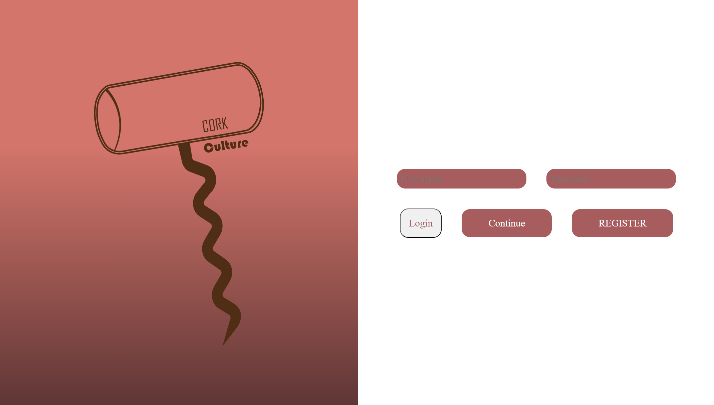
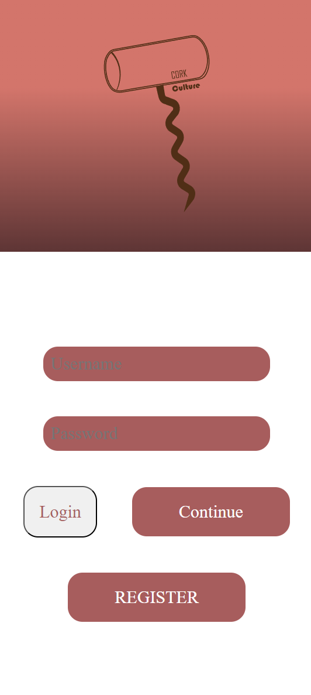
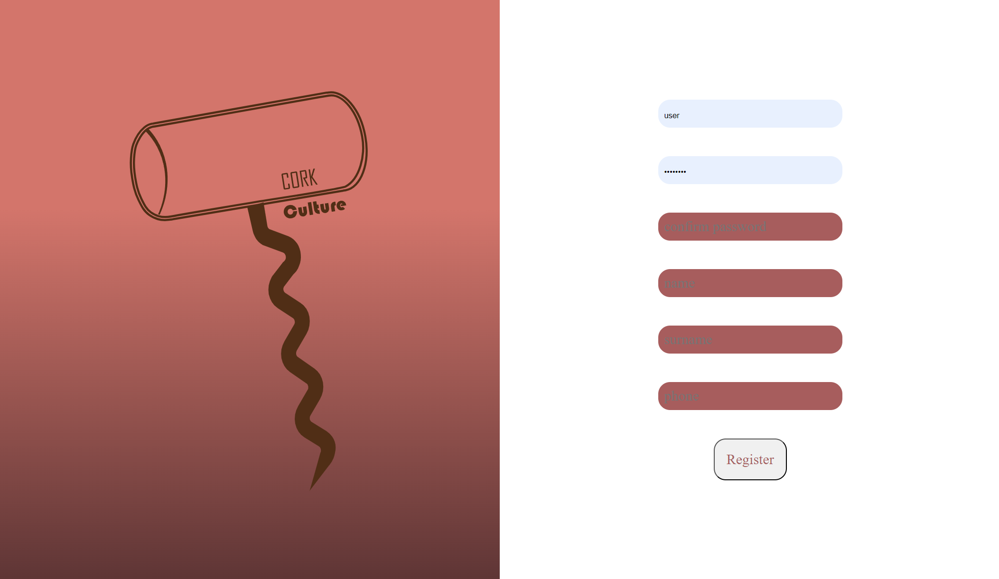
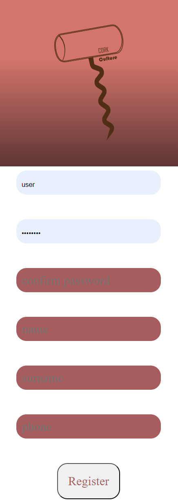
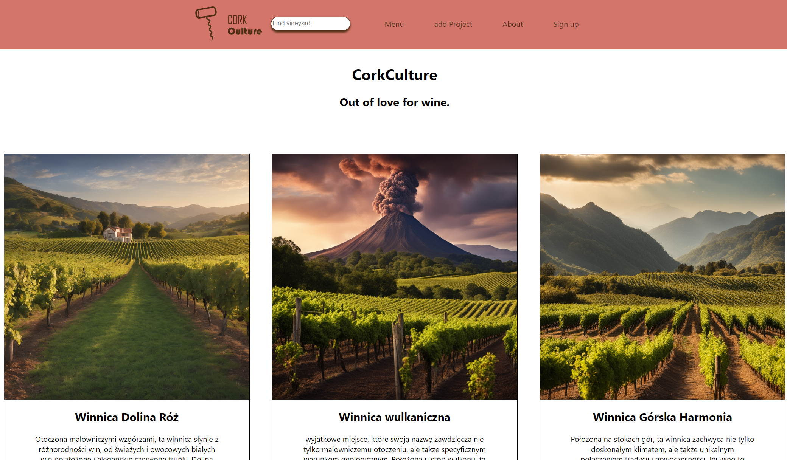
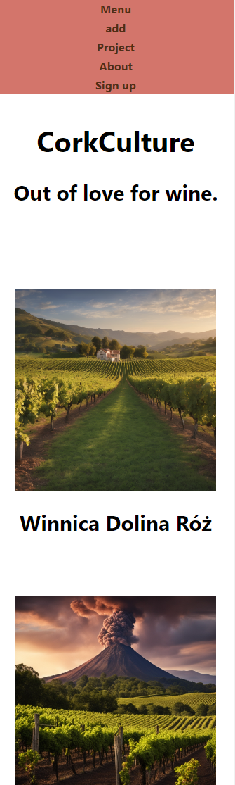
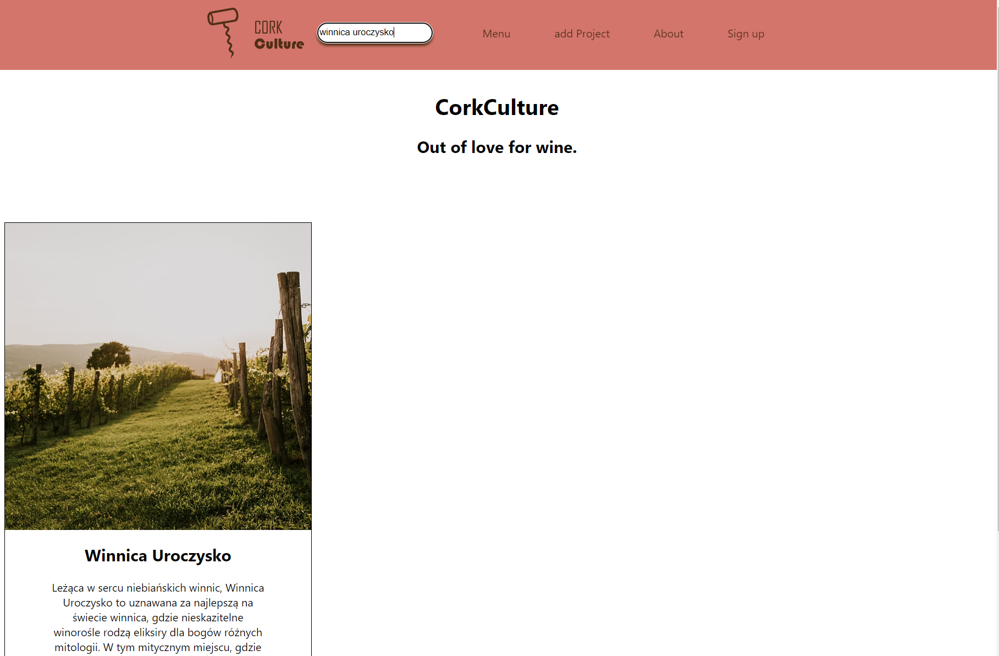
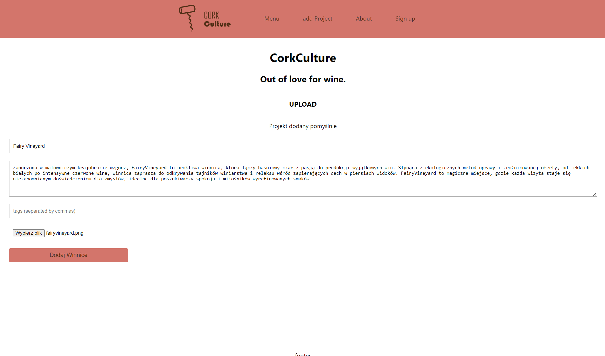
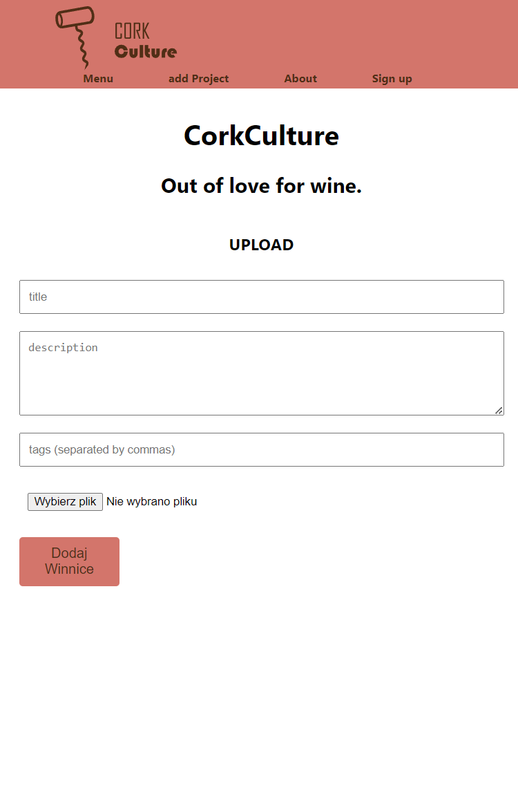

# CorkCulture

CorkCulture to aplikacja internetowa, która promuje kulturę winiarską, umożliwiając użytkownikom dzielenie się swoimi doświadczeniami związanych z winem oraz odkrywanie nowych winnic i trunków z różnych regionów. Aplikacja zapewnia platformę, gdzie pasjonaci wina mogą dzielić się informacjami, recenzjami i zdjęciami związanych z winem, a także poznawać nowe obszary winiarskie.

## O Projekcie

CorkCulture to inicjatywa mająca na celu połączenie miłośników wina z różnych zakątków świata. Aplikacja umożliwia użytkownikom dodawanie nowych projektów winiarskich, opisywanie ich unikalnych cech, historii oraz udostępnianie zdjęć. Dodatkowo, użytkownicy mogą przeglądać projekty innych użytkowników, szukać winnic w określonych regionach oraz odkrywać nowe smaki i aromaty.

## Instalacja

Aby zainstalować i uruchomić projekt CorkCulture lokalnie, wykonaj poniższe kroki:

1. **Backend (Django):**
   - Sklonuj repozytorium: `git clone https://github.com/hausandrzej/kulturakorka.git`
   - Przejdź do katalogu projektu: `cd kulturakorka/backend`
   - Zainstaluj zależności Pythona: `pip install -r requirements.txt`
   - Uruchom migracje bazy danych: `python manage.py migrate`
   - Uruchom serwer: `python manage.py runserver`

2. **Frontend (React):**
   - Przejdź do katalogu frontend: `cd kulturakorka/frontend`
   - Zainstaluj zależności NPM: `npm install`
   - Uruchom aplikację: `npm start`

3. **Otwórz w przeglądarce:**
   - Wejdź na stronę [http://localhost:3000](http://localhost:3000) w przeglądarce.

Teraz możesz korzystać z aplikacji CorkCulture na swoim lokalnym środowisku.

## Działanie 

Strona logowania:

  
   

strona rejestracji:

  
   

Menu:

  
   

Wyszukiwanie projektu:

  

Dodawanie projetu:

  
   

